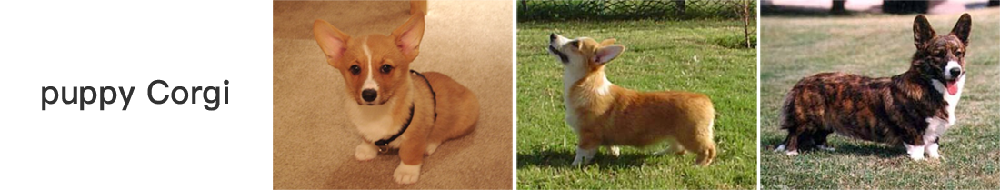

&nbsp;

<p align="center">
    
    
</p>


<h3 align="center">
  <p style="text-align: center;"> <span style="font-weight: bold; font: Arial, sans-serif;">x</span>2vec, Towhee is all you need! </p>
</h3>

<h3 align="center">
  <p style="text-align: center;">
  <a href="https://github.com/towhee-io/towhee/blob/main/README.md" target="_blank">ENGLISH</a> | <a href="https://github.com/towhee-io/towhee/blob/main/README-CN.md">中文文档</a>
  </p>
</h3>

<div class="column" align="middle">
  <a href="https://slack.towhee.io">
    
  </a>
  <a href="https://twitter.com/towheeio">
    
  </a>
  <a href="https://www.apache.org/licenses/LICENSE-2.0">
    
  </a>
  <a href="https://github.com/towhee-io/towhee/actions/workflows/pylint.yml">
    
  </a>
  <a href="https://app.codecov.io/gh/towhee-io/towhee">
    
  </a>
</div>

&nbsp;

[Towhee](https://towhee.io) makes it easy to build neural data processing pipelines for AI applications.
We provide several hundred models, algorithms, and transformations as standard pipeline building blocks.
You can prototype your pipeline with our Pythonic API, and use Towhee to
automatically optimize it for production-ready environments.

:art:&emsp;**Various Modalities:** We support data processing on different modalities, such as images, videos, text, audio, molecular structures, etc.

:mortar_board:&emsp;**SOTA Models:** We provide SOTA models across 5 fields (CV, NLP, Multimodal, Audio, Medical), 15 tasks, 140+ model architectures, 700+ pretrained models. These include BERT, CLIP, ViT, SwinTransformer, MAE, data2vec, etc.

:package:&emsp;**Data Processing:** Towhee also provides traditional data processing methods that can be used together with neural network models to help you build practical data processing pipelines. Video decoding, audio slicing, frame sampling, feature vector dimension reduction, model ensemble, and database operations are a small sample of the different operators we provide.

:snake:&emsp;**Pythonic API:** Towhee includes a pythonic method-chaining API for describing custom data processing pipelines. We also support schemas, making processing unstructured data as easy as handling tabular data.

## What's New

**v0.7.3 Jul.27,2022**
* Add one multimodal (text/image) model:
[*CoCa*](https://github.com/towhee-io/towhee/tree/branch0.7.3/towhee/models/coca).
* Add two video models for grounded situation recognition & repetitive action counting:
[*CoFormer*](https://github.com/towhee-io/towhee/tree/branch0.7.3/towhee/models/coformer),
[*TransRAC*](https://github.com/towhee-io/towhee/tree/branch0.7.3/towhee/models/transrac).
* Add two SoTA models for image tasks (image retrieval, image classification, etc.):
[*CVNet*](https://github.com/towhee-io/towhee/tree/branch0.7.3/towhee/models/cvnet),
[*MaxViT*](https://github.com/towhee-io/towhee/tree/branch0.7.3/towhee/models/max_vit)

**v0.7.1 Jul.1,2022**
* Add one image embedding model:
[*MPViT*](https://towhee.io/image-embedding/mpvit).
* Add two video retrieval models:
[*BridgeFormer*](https://towhee.io/video-text-embedding/bridge-former),
[*collaborative-experts*](https://towhee.io/video-text-embedding/collaborative-experts).
* Add FAISS-based ANNSearch operators: *to_faiss*, *faiss_search*.

**v0.7.0 Jun.24,2022**

* Add six video understanding/classification models:
[*Video Swin Transformer*](https://towhee.io/action-classification/video-swin-transformer), 
[*TSM*](https://towhee.io/action-classification/tsm), 
[*Uniformer*](https://towhee.io/action-classification/uniformer), 
[*OMNIVORE*](https://towhee.io/action-classification/omnivore), 
[*TimeSformer*](https://towhee.io/action-classification/timesformer), 
[*MoViNets*](https://towhee.io/action-classification/movinet).
* Add four video retrieval models:
[*CLIP4Clip*](https://towhee.io/video-text-embedding/clip4clip), 
[*DRL*](https://towhee.io/video-text-embedding/drl), 
[*Frozen in Time*](https://towhee.io/video-text-embedding/frozen-in-time), 
[*MDMMT*](https://towhee.io/video-text-embedding/mdmmt).


**v0.6.1  May.13,2022**

* Add three text-image retrieval models:
[*CLIP*](https://towhee.io/image-text-embedding/clip),
[*BLIP*](https://towhee.io/image-text-embedding/blip),
[*LightningDOT*](https://towhee.io/image-text-embedding/lightningdot).
* Add six video understanding/classification models from PyTorchVideo:
[*I3D*](https://towhee.io/action-classification/pytorchvideo),
[*C2D*](https://towhee.io/action-classification/pytorchvideo),
[*Slow*](https://towhee.io/action-classification/pytorchvideo),
[*SlowFast*](https://towhee.io/action-classification/pytorchvideo),
[*X3D*](https://towhee.io/action-classification/pytorchvideo),
[*MViT*](https://towhee.io/action-classification/pytorchvideo).

## Getting started

Towhee requires Python 3.6+. Towhee can be installed via `pip`:

```bash
pip install towhee towhee.models
```

If you run into any pip-related install problems, please try to upgrade pip with `pip install -U pip`.

Try your first Towhee pipeline. In this example, we show how to create a CLIP-based cross modal retrieval pipeline within 15 lines of code.

```python
import towhee

# create image embeddings and build index
(
    towhee.glob['file_name']('./*.png')
          .image_decode['file_name', 'img']()
          .image_text_embedding.clip['img', 'vec'](model_name='clip_vit_b32', modality='image')
          .tensor_normalize['vec','vec']()
          .to_faiss[('file_name', 'vec')](findex='./index.bin')
)

# search image by text
results = (
    towhee.dc['text'](['puppy Corgi'])
          .image_text_embedding.clip['text', 'vec'](model_name='clip_vit_b32', modality='text')
          .tensor_normalize['vec', 'vec']()
          .faiss_search['vec', 'results'](findex='./index.bin', k=3)
          .select['text', 'results']()
)
```


Learn more examples from [Towhee bootcamp](https://codelabs.towhee.io/)

## Core Concepts

Towhee is composed of four main building blocks - `Operators`, `Pipelines`, `DataCollection API` and `Engine`.

- __Operator__: An operator is a single building block of neural data processing pipelines. Different implementations of operators are categorized by tasks, with standard task interface. An operator can be a deep learning model, a data processing method, or a Python function.

- __Pipeline__: A pipeline is composed of several operators. Operators are connected together as a DAG(directed acyclic graph) to create complex functionalities, such as embedding feature extraction, data tagging, cross modal data understanding, etc.

- __DataCollection__: A pythonic and method-chaining style API that for building custom pipelines. Pipelines defined by DataColltion API can be either run on notebook locally for fast prototyping, or converting to image docker with end-to-end optimization for production-ready environments. 

- __Engine__: The engine sits at Towhee's core. Given a pipeline, the engine will drive dataflow between individual operators, schedule tasks, and monitor compute resource (CPU/GPU/etc) usage. We provide a basic engine within Towhee to run pipelines on a single-instance machine, and Triton-based engine to run pipelines in docker containers.

## Contributing

Remember that writing code is not the only way to contribute! Submitting issues, answering questions, and improving documentation are some of the many ways you can join our growing community. Check out our [contributing page](https://github.com/towhee-io/towhee/blob/main/CONTRIBUTING.md) for more information.

Special thanks goes to these folks for contributing to Towhee, either on Github, our Towhee Hub, or elsewhere:
<br><!-- Do not remove start of hero-bot --><br>
<br>
<a href="https://github.com/Chiiizzzy"></a>
<a href="https://github.com/GuoRentong"></a>
<a href="https://github.com/Tumao727"></a>
<a href="https://github.com/binbinlv"></a>
<a href="https://github.com/derekdqc"></a>
<a href="https://github.com/filip-halt"></a>
<a href="https://github.com/fzliu"></a>
<a href="https://github.com/gexy185"></a>
<a href="https://github.com/jaelgu"></a>
<a href="https://github.com/jeffoverflow"></a>
<a href="https://github.com/jennyli-z"></a>
<a href="https://github.com/jingkl"></a>
<a href="https://github.com/jinlingxu06"></a>
<a href="https://github.com/junjiejiangjjj"></a>
<a href="https://github.com/krishnakatyal"></a>
<a href="https://github.com/omartarek206"></a>
<a href="https://github.com/oneseer"></a>
<a href="https://github.com/pravee42"></a>
<a href="https://github.com/reiase"></a>
<a href="https://github.com/shiyu22"></a>
<a href="https://github.com/soulteary"></a>
<a href="https://github.com/sre-ci-robot"></a>
<a href="https://github.com/sutcalag"></a>
<a href="https://github.com/wxywb"></a>
<a href="https://github.com/zc277584121"></a>
<a href="https://github.com/zhousicong"></a>
<a href="https://github.com/zhujiming"></a>
<br><!-- Do not remove end of hero-bot --><br>

Looking for a database to store and index your embedding vectors? Check out [Milvus](https://github.com/milvus-io/milvus).
