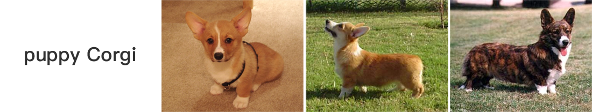

 

<p align="center">
    
    
</p>


<h3 align="center">
  <p style="text-align: center;"> <span style="font-weight: bold; font: Arial, sans-serif;">x</span>2vec, Towhee is all you need! </p>
</h3>

<h3 align="center">
  <p style="text-align: center;">
  <a href="README.md" target="_blank">ENGLISH</a> | <a href="README_CN.md">中文文档</a>
  </p>
</h3>

<div class="column" align="middle">
  <a href="https://slack.towhee.io">
    
  </a>
  <a href="https://twitter.com/towheeio">
    
  </a>
  <a href="https://www.apache.org/licenses/LICENSE-2.0">
    
  </a>
  <a href="https://github.com/towhee-io/towhee/actions/workflows/pylint.yml">
    
  </a>
  <a href="https://pypi.org/project/towhee/">
    
  </a>
  <a href="https://app.codecov.io/gh/towhee-io/towhee">
    
  </a>
</div>

&nbsp;

[Towhee](https://towhee.io) 可以让用户像搭积木一样，轻松地完成 AI 应用程序的构建和落地。通过使用大语言模型(LLM)以及其他SOTA深度学习模型，从各种未加工过的非结构化数据中（长文本、图像、音频和视频）提取信息，并将这些信息存储到合适的存储系统中,比如可以将提取出的向量数据存储到向量数据库中。开发人员能够通过Towhee提供的Pythonic API来完成各种 AI 流水线和 AI 应用的原型设计，享受自动代码优化，低成本实现生产环境的应用性能优化。


## ✨ 项目特点

🎨 **多模态** Towhee 能够处理各种数据类型。无论是图像数据、视频片段、文本、音频文件还是分子结构,Towhee 都可以处理。

📃 **LLM 管道编排** Towhee 具有灵活性,可以适应不同的大语言模型(LLM)。此外,它允许在本地托管开源大模型。此外,Towhee 提供了prompt管理和知识检索等功能,使与这些 LLM 的交互更加高效和有效。 

🎓 **丰富的算子** Towhee 提供了五个领域内众多最先进的现成模型:计算机视觉、自然语言处理、多模态、音频和医疗领域。拥有超过 140 个模型,如 BERT 和 CLIP,以及丰富的功能,如视频解码、音频切片、帧采样和降维,它有助于高效地搭建数据处理流水线。

🔌 **预构建的 ETL 管道** Towhee 提供现成的 ETL(提取、转换、加载)管道用于常见任务,如增强生成检索、文本图像搜索和视频副本检测。这意味着您不需要成为 AI 专家即可使用这些功能构建应用程序。 

⚡️ **高性能后端** 利用 Triton 推理服务器的计算能力,Towhee 可以使用 TensorRT、Pytorch 和 ONNX 等平台加速 CPU 和 GPU 上的模型服务。此外,您可以用几行代码将 Python 管道转换为高性能的 Docker 容器,实现高效部署和扩展。

🐍 **Python 风格的 API** Towhee 包含一个 Python 风格的方法链 API,用于描述自定义数据处理流水线。我们还支持模式,这使得处理非结构化数据就像处理表格数据一样简单。


## 🎓 快速入门

Towhee 需要 Python 3.7 及以上的运行环境，可以通过 `pip` 来完成快速安装：

```bash
pip install towhee towhee.models
```

## 流水线

### 预定义流水线

Towhee 提供了一些预定义流水线，可以帮助用户快速实现一些功能。
目前已经实现的有：
- [文本embedding](https://towhee.io/tasks/detail/pipeline/sentence-similarity)
- [图像embedding](https://towhee.io/tasks/detail/pipeline/text-image-search)
- [视频去重](https://towhee.io/tasks/detail/pipeline/video-copy-detection)
- [基于大语言模型的知识库问答](https://towhee.io/tasks/detail/pipeline/retrieval-augmented-generation)

所有的流水线均能在Towhee Hub上找到，下面是sentence_embedding流水线的使用示例:

```python
from towhee import AutoPipes, AutoConfig
# get the built-in sentence_similarity pipeline
config = AutoConfig.load_config('sentence_embedding')
config.model = 'paraphrase-albert-small-v2'
config.device = 0
sentence_embedding = AutoPipes.pipeline('sentence_embedding', config=config)

# generate embedding for one sentence
embedding = sentence_embedding('how are you?').get()
# batch generate embeddings for multi-sentences
embeddings = sentence_embedding.batch(['how are you?', 'how old are you?'])
embeddings = [e.get() for e in embeddings]
```
### 自定义流水线

通过Towhee python API，可以实现自定义的流水线, 下面示例中，我们来创建一个基于 CLIP 的跨模态检索流水线。

```python
from towhee import ops, pipe, DataCollection
# create image embeddings and build index
p = (
    pipe.input('file_name')
    .map('file_name', 'img', ops.image_decode.cv2())
    .map('img', 'vec', ops.image_text_embedding.clip(model_name='clip_vit_base_patch32', modality='image'))
    .map('vec', 'vec', ops.towhee.np_normalize())
    .map(('vec', 'file_name'), (), ops.ann_insert.faiss_index('./faiss', 512))
    .output()
)

for f_name in ['https://raw.githubusercontent.com/towhee-io/towhee/main/assets/dog1.png',
               'https://raw.githubusercontent.com/towhee-io/towhee/main/assets/dog2.png',
               'https://raw.githubusercontent.com/towhee-io/towhee/main/assets/dog3.png']:
    p(f_name)

# Flush faiss data into disk. 
p.flush()
# search image by text
decode = ops.image_decode.cv2('rgb')
p = (
    pipe.input('text')
    .map('text', 'vec', ops.image_text_embedding.clip(model_name='clip_vit_base_patch32', modality='text'))
    .map('vec', 'vec', ops.towhee.np_normalize())
    # faiss op result format:  [[id, score, [file_name], ...]
    .map('vec', 'row', ops.ann_search.faiss_index('./faiss', 3))
    .map('row', 'images', lambda x: [decode(item[2][0]) for item in x])
    .output('text', 'images')
)

DataCollection(p('puppy Corgi')).show()
```





## 🚀 核心概念

Towhee 由四个主要模块组成：“算子（Operators）”、“流水线（Pipelines）”、“数据处理 API（DataCollection API）”和“执行引擎（Engine）”。

- __算子（Operator）__：算子是构成神经网络数据处理水流线(neural data processing pipeline)的“积木块”（基础组件）。这些基础组件按照任务类型进行组织，每种任务类型都具有标准的调用接口。一个算子可以是某种神经网络模型，某种数据处理方法，或是某个 Python 函数。

- __流水线（Pipeline）__：流水线是由若干个算子组成的 DAG（有向无环图）。流水线可以实现比单个算子更复杂的功能，诸如特征向量提取、数据标记、跨模态数据理解等。

- __数据处理 API（DataCollection）__: DataCollection API 是用于描述流水线的编程接口。提供多种数据转换接口：map, filter, flat_map, concat, window, time_window以及window_all，通过这些接口，可以快速构建复杂的数据处理管道，处理视频，音频，文本，图像等非结构化数据。

- __执行引擎（Engine）__: 执行引擎负责实例化流水线、任务调度、资源管理，以及运行期性能优化。面向快速原型构建，Towhee 提供了轻量级的本地执行引擎；面向生产环境需求，Towhee 提供了基于 Nvidia Triton 的高性能执行引擎。

## 资源

- TowheeHub: https://towhee.io/
- 文档: https://towhee.readthedocs.io/en/latest/
- 示例: https://github.com/towhee-io/examples

## 🏠 了解 & 加入社区

**编写代码并不是参与项目的唯一方式！**

你可以通过很多方式来参与 Towhee 社区：提交问题、回答问题、改进文档、加入社群讨论、参加线下 Meetup 活动等。

你的参与对于项目的持续健康发展至关重要。欢迎查阅 🎁[贡献页面](https://github.com/towhee-io/towhee/blob/main/CONTRIBUTING.md) 的文档内容，了解更多详细信息。

### 💥 致谢

特别感谢下面的同学为 Towhee 社区做出的贡献 🌹：

<br><!-- Do not remove start of hero-bot --><br>
<br>
<a href="https://github.com/3270939387"></a>
<a href="https://github.com/AniTho"></a>
<a href="https://github.com/Chiiizzzy"></a>
<a href="https://github.com/GuoRentong"></a>
<a href="https://github.com/KizAE86"></a>
<a href="https://github.com/NicoYuan1986"></a>
<a href="https://github.com/Opdoop"></a>
<a href="https://github.com/Sharp-rookie"></a>
<a href="https://github.com/Tumao727"></a>
<a href="https://github.com/UncleLLD"></a>
<a href="https://github.com/YuDongPan"></a>
<a href="https://github.com/binbinlv"></a>
<a href="https://github.com/derekdqc"></a>
<a href="https://github.com/dreamfireyu"></a>
<a href="https://github.com/filip-halt"></a>
<a href="https://github.com/fzliu"></a>
<a href="https://github.com/gexy185"></a>
<a href="https://github.com/huan415"></a>
<a href="https://github.com/hyf3513OneGO"></a>
<a href="https://github.com/jaelgu"></a>
<a href="https://github.com/jeffoverflow"></a>
<a href="https://github.com/jingkl"></a>
<a href="https://github.com/jinlingxu06"></a>
<a href="https://github.com/junjiejiangjjj"></a>
<a href="https://github.com/krishnakatyal"></a>
<a href="https://github.com/lrk612"></a>
<a href="https://github.com/omartarek206"></a>
<a href="https://github.com/oneseer"></a>
<a href="https://github.com/pravee42"></a>
<a href="https://github.com/reiase"></a>
<a href="https://github.com/sanbuphy"></a>
<a href="https://github.com/shiyu22"></a>
<a href="https://github.com/songxianj"></a>
<a href="https://github.com/soulteary"></a>
<a href="https://github.com/sre-ci-robot"></a>
<a href="https://github.com/sutcalag"></a>
<a href="https://github.com/wxywb"></a>
<a href="https://github.com/xychu"></a>
<a href="https://github.com/zc277584121"></a>
<a href="https://github.com/zengxiang68"></a>
<a href="https://github.com/zhousicong"></a>
<br><!-- Do not remove end of hero-bot --><br>

如果你正在寻找用于存储和检索向量的数据库，不妨看看[Milvus](https://github.com/milvus-io/milvus)。
