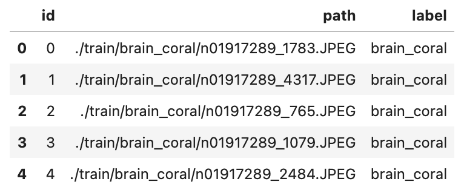
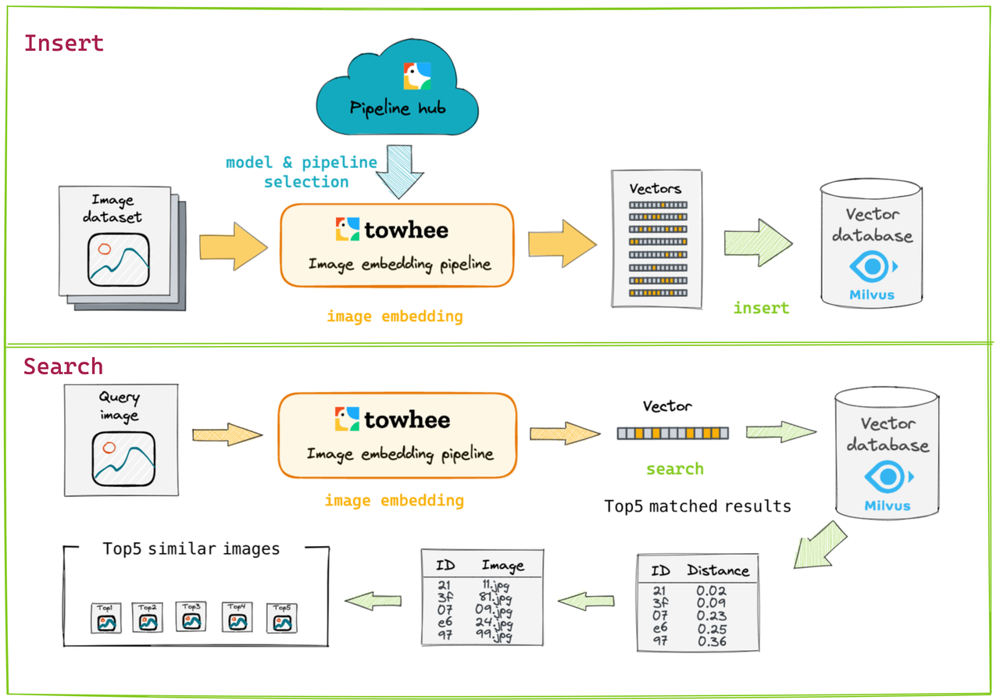
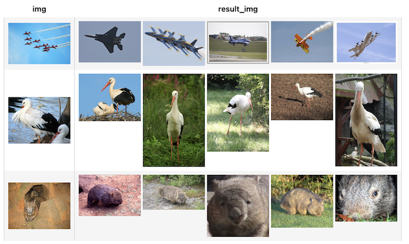
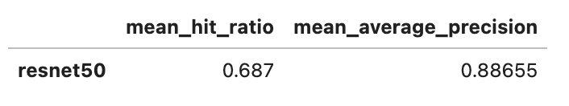
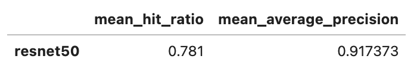
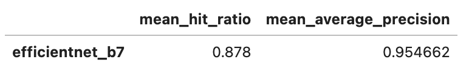
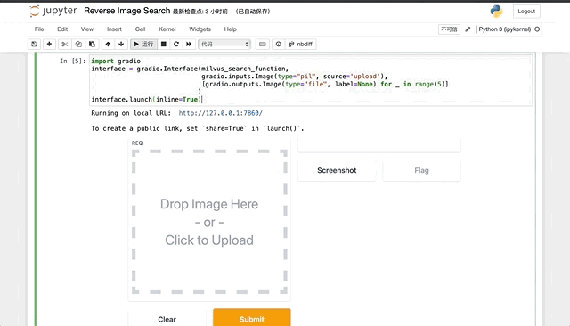

# Reverse Image Search

This tutorial can run as [jupyter notebook](https://jupyter.org/install), you can refer to [Build an Image Search Engine in Minutes](https://github.com/towhee-io/examples/blob/main/image/reverse_image_search/build_image_search_engine.ipynb). Have fun with it!

> If you are interested in how to deploy online service with large-scale image data, you can refert to another notebook "[Deep Dive into Real-World Image Search Engine with Towhee](https://github.com/towhee-io/examples/blob/main/image/reverse_image_search/deep_dive_image_search.ipynb)", you will lean how to optimize algorithm, feed with large-scale image datasets, and deploy as a micro-service. 

## Scenario introduction

**Reverse image search** helps you search for similar or related images given an input image. Reverse image search is a [content-based image retrieval](https://en.wikipedia.org/wiki/Content-based_image_retrieval) (CBIR) query technique that involves providing the CBIR system with a query image that it will then base its search upon. Unlike the traditional image search (which often relies on performing text queries across user-generated labels), reverse image search is based on the content of the image itself.

A few applications of reverse image search include finding the original source of an image, searching for similar content, and product recommendation.

## Overview

This tutorial illustrates how to build an image search engine from scratch using [Milvus](https://milvus.io/). We'll go through image search procedures and evaluate the performance. Moreover, we managed to make the core functionality as simple as 15 lines of code, with which you can start hacking your own image search engine.

## Preparation

### Prepare the data

First, we need to prepare the dataset and Milvus environment. A subset of the ImageNet dataset (100 classes, 10 images for each class) is used in this demo, and the dataset is available via [Google Drive](https://drive.google.com/file/d/1lRhHODcFXUEHf7n-GFlvYgBikhg81KbB/view?usp=sharing) and [Github](https://github.com/towhee-io/data/raw/main/image/reverse_image_search.zip).

The dataset is organized as follows:

- **train**: directory of candidate images;
- **test**: directory of the query images;
- **reverse_image_search.csv**: a csv file containing an ***id\***, ***path\***, and ***label\*** for each image;

```bash
$ curl -L https://github.com/towhee-io/data/raw/main/image/reverse_image_search.zip -O
$ unzip -q -o reverse_image_search.zip
```

Let's take a quick look on the csv file:

```python
import pandas as pd

df = pd.read_csv('reverse_image_search.csv')
df.head()
```




To use the dataset for image search, let's first define some helper functions:

- **read_images(results)**: read images by image IDs;
- **ground_truth(path)**: ground-truth for each query image, which is used for calculating mHR(mean hit ratio) and mAP(mean average precision);

```python
import cv2
from towhee._types.image import Image

id_img = df.set_index('id')['path'].to_dict()
label_ids = {}
for label in set(df['label']):
    label_ids[label] = list(df[df['label']==label].id)

def read_images(results):
    imgs = []
    for re in results:
        path = id_img[re.id]
        imgs.append(Image(cv2.imread(path), 'BGR'))
    return imgs

def ground_truth(path):
    label = path.split('/')[-2]
    return label_ids[label]
```

### Create a Milvus Collection

Before getting started, please make sure you have [installed milvus](https://milvus.io/docs/v2.0.x/install_standalone-docker.md). Let's first create a `reverse_image_search` collection that uses the [L2 distance metric](https://milvus.io/docs/v2.0.x/metric.md#Euclidean-distance-L2) and an [IVF_FLAT index](https://milvus.io/docs/v2.0.x/index.md#IVF_FLAT).

```python
from pymilvus import connections, FieldSchema, CollectionSchema, DataType, Collection, utility

def create_milvus_collection(collection_name, dim):
    connections.connect(host='127.0.0.1', port='19530')
    
    if utility.has_collection(collection_name):
        utility.drop_collection(collection_name)
    
    fields = [
    FieldSchema(name='id', dtype=DataType.INT64, descrition='ids', is_primary=True, auto_id=False),
    FieldSchema(name='embedding', dtype=DataType.FLOAT_VECTOR, descrition='embedding vectors', dim=dim)
    ]
    schema = CollectionSchema(fields=fields, description='reverse image search')
    collection = Collection(name=collection_name, schema=schema)

    # create IVF_FLAT index for collection.
    index_params = {
        'metric_type':'L2',
        'index_type':"IVF_FLAT",
        'params':{"nlist":2048}
    }
    collection.create_index(field_name="embedding", index_params=index_params)
    return collection

collection = create_milvus_collection('reverse_image_search', 2048)
```

## Reverse Image Search

In this section, we'll show how to build our image search engine using Milvus. The basic idea behind semantic image search is the extract embeddings from images using a deep neural network and compare the embeddings with those stored in Milvus.

We use [Towhee](https://towhee.io/), a machine learning framework that allows for creating data processing pipelines. [Towhee](https://towhee.io/) also provides predefined operators which implement insert and query operation in Milvus.




### Load Image Embeddings into Milvus

We first extract embeddings from images with `resnet50` model and insert the embeddings into Milvus for indexing. Towhee provides a [method-chaining style API](https://towhee.readthedocs.io/en/main/index.html) so that users can assemble a data processing pipeline with operators.

```python
import towhee

collection = create_milvus_collection('reverse_image_search', 2048)

dc = (
    towhee.read_csv('reverse_image_search.csv')
      .runas_op['id', 'id'](func=lambda x: int(x))
      .image_decode['path', 'img']()
      .image_embedding.timm['img', 'vec'](model_name='resnet50')
      .to_milvus['id', 'vec'](collection=collection, batch=100)
)
```

#### Explanation of Data Processing Pipeline

Here is detailed explanation for each line of the code:

- `towhee.read_csv('reverse_image_search.csv')`: read tabular data from csv file (`id`, `path` and `label` columns);
- `.runas_op['id', 'id'](func=lambda x: int(x))`: for each row from the data, convert the data type of the column `id` from `str` to `int`;
- `.image_decode['path', 'img']()`: for each row from the data, read and decode the image at `path` and put the pixel data into column `img`;
- `.image_embedding.timm['img', 'vec'](model_name='resnet50')`: extract embedding feature with `image_embedding.timm`, an operator from the [Towhee hub](https://towhee.io/image-embedding/timm) based on [pytorch-image-models](https://github.com/rwightman/pytorch-image-models). This operator supports a variety of image models trained on [ImageNet](https://image-net.org/), including `vgg16`, `resnet50`, `vit_base_patch8_224`, `convnext_base`, etc.
- `.tensor_normalize['vec', 'vec']()`: normalize the resulting embedding vector;
- `.to_milvus['id', 'vec'](collection=collection, batch=100)`: insert image embedding features in to Milvus;

### Query Similar Images from Milvus

Now that embeddings for candidate images have been inserted into Milvus, we can query across it for nearest neighbors. Again, we use Towhee to load the input image, compute an embedding vector, and use the vector as a query for Milvus. Because Milvus only outputs image IDs and distance values, we provide a `read_images` function to get the original image based on IDs and display.

```
(
    towhee.glob['path']('./test/w*/*.JPEG')
      .image_decode['path', 'img']()
      .image_embedding.timm['img', 'vec'](model_name='resnet50')
      .milvus_search['vec', 'result'](collection=collection, limit=5)
      .runas_op['result', 'result_img'](func=read_images)
      .select['img', 'result_img']()
      .show()
)
```



## Evaluation

We have finished the core functionality of the image search engine. However, we don't know whether it achieves a reasonable performance. We need to evaluate the search engine against the ground truth so that we know if there is any room to improve it.

In this section, we'll evaluate the strength of our image search engine using mHR and mAP:

- [mHR (recall@K)](https://amitness.com/2020/08/information-retrieval-evaluation/#2-recallk): This metric describes how many actual relevant results were returned out of all ground-truth relevant results by the search engine. For example, if we have put 100 pictures of cats into the search engine and then query the image search engine with another picture of cats. The total relevant result is 100, and the actual relevant results are the number of cat images in the top 100 results returned by the search engine. If there are 80 images about cats in the search result, the hit ratio is 80/100;
- [mAP](https://amitness.com/2020/08/information-retrieval-evaluation/#3-mean-average-precisionmap): Average precision describes whether all of the relevant results are ranked higher than irrelevant results.

```python
benchmark = (
    towhee.glob['path']('./test/*/*.JPEG')
        .image_decode['path', 'img']()
        .image_embedding.timm['img', 'vec'](model_name='resnet50')
        .milvus_search['vec', 'result'](collection=collection, limit=10)
        .runas_op['path', 'ground_truth'](func=ground_truth)
        .runas_op['result', 'result'](func=lambda res: [x.id for x in res])
        .with_metrics(['mean_hit_ratio', 'mean_average_precision'])
        .evaluate['ground_truth', 'result']('resnet50')
        .report()
)
```




### Optimization I: embedding vector normalization

A quick optimization is normalizing the embedding features before indexing them in Milvus. This results in *cosine similarity*, which measures the similarity between two vectors using the angle between them while ignoring the magnitude of the vectors.

```python
collection = create_milvus_collection('reverse_image_search_norm', 2048)

dc = (
    towhee.read_csv('reverse_image_search.csv')
      .runas_op['id', 'id'](func=lambda x: int(x))
      .image_decode['path', 'img']()
      .image_embedding.timm['img', 'vec'](model_name='resnet50')
      .tensor_normalize['vec', 'vec']()
      .to_milvus['id', 'vec'](collection=collection, batch=100)
)

benchmark = (
    towhee.glob['path']('./test/*/*.JPEG')
        .image_decode['path', 'img']()
        .image_embedding.timm['img', 'vec'](model_name='resnet50')
        .tensor_normalize['vec', 'vec']()
        .milvus_search['vec', 'result'](collection=collection, limit=10)
        .runas_op['path', 'ground_truth'](func=ground_truth)
        .runas_op['result', 'result'](func=lambda res: [x.id for x in res])
        .with_metrics(['mean_hit_ratio', 'mean_average_precision'])
        .evaluate['ground_truth', 'result']('resnet50')
        .report()
)
```




### Optimization II: increase model complexity

Another quick optimization is increase model complexity (at the cost of runtime). With Towhee, this is very easy: we simply replace Resnet-50 with [EfficientNet-B7](https://pytorch.org/vision/stable/models.html#classification), an image classificiation model which has better accuracy on ImageNet. Although Towhee provides a pre-trained EfficientNet-B7 model via `timm`, we'll use `torchvision` to demonstrate how external models and functions can be used within Towhee.

```python
import torch
import towhee
from torchvision import models
from torchvision import transforms
from PIL import Image as PILImage


torch_model = models.efficientnet_b7(pretrained=True)
torch_model = torch.nn.Sequential(*(list(torch_model.children())[:-1]))
torch_model.to('cuda' if torch.cuda.is_available() else 'cpu')
torch_model.eval()
preprocess = transforms.Compose([
    transforms.Resize(size=224, interpolation=transforms.InterpolationMode.BICUBIC),
    transforms.ToTensor(),
    transforms.Normalize(
        mean=[0.485, 0.456, 0.406],
        std=[0.229, 0.224, 0.225]
    )
])

def efficientnet_b7(img):
    img = cv2.cvtColor(img, cv2.COLOR_BGR2RGB)
    img = PILImage.fromarray(img.astype('uint8'), 'RGB')
    img = torch.unsqueeze(preprocess(img), 0)
    img = img.to('cuda' if torch.cuda.is_available() else 'cpu')
    embedding = torch_model(img).detach().cpu().numpy()
    return embedding.reshape([2560])
```

Then use `efficientnet_b7` to generate embedding vector and show the evaluation.

```python
collection = create_milvus_collection('image_search_efficientnet_b7', 2560)

dc = (
    towhee.read_csv('reverse_image_search.csv')
        .runas_op['id', 'id'](func=lambda x: int(x))
        .image_decode['path', 'img']()
        .runas_op['img', 'vec'](func=efficientnet_b7)
        .tensor_normalize['vec', 'vec']()
        .to_milvus['id', 'vec'](collection=collection, batch=100)
    )

benchmark = (
    towhee.glob['path']('./test/*/*.JPEG')
        .image_decode['path', 'img']()
        .runas_op['img', 'vec'](func=efficientnet_b7)
        .tensor_normalize['vec', 'vec']()
        .milvus_search['vec', 'result'](collection=collection, limit=10)
        .runas_op['path', 'ground_truth'](func=ground_truth)
        .runas_op['result', 'result'](func=lambda res: [x.id for x in res])
        .with_metrics(['mean_hit_ratio', 'mean_average_precision'])
        .evaluate['ground_truth', 'result']('efficientnet_b7')
        .report()
)
```




## Release a Showcase

We've done an excellent job on the core functionality of our image search engine. Now it's time to build a showcase with interface. [Gradio](https://gradio.app/) is a great tool for building demos. With Gradio, we simply need to wrap the data processing pipeline via a `search_in_milvus` function:

```python
import gradio
from towhee.types.image_utils import from_pil

with towhee.api() as api:
    milvus_search_function = (
        api.runas_op(func=lambda img: from_pil(img))
            .image_embedding.timm(model_name='resnet50')
            .tensor_normalize()
            .milvus_search(collection='reverse_image_search_norm', limit=5)
            .runas_op(func=lambda res: [id_img[x.id] for x in res])
            .as_function()
    )

interface = gradio.Interface(milvus_search_function, 
                             gradio.inputs.Image(type="pil", source='upload'),
                             [gradio.outputs.Image(type="file", label=None) for _ in range(5)])

interface.launch(inline=True)
```


