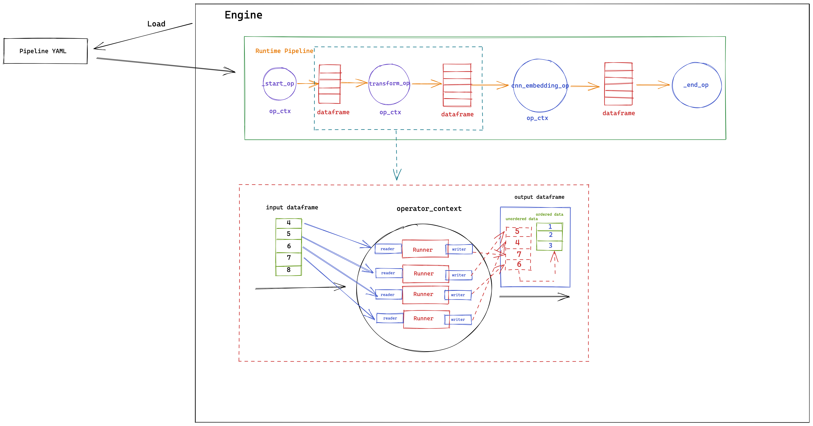

### Architecture overview

##### Basic components

**Operator**

The Operator forms the basic building block for Towhee. To maximize flexibility while still maintaining compatibility with existing deep learning libraries, each operator is considered a single _transformation_, or unit of work, on the input data. As such, operators are not limited to neural networks; traditional ML models, image processing algorithms, or even simple Python scripts can all be packaged as Towhee operators and provided to users via the Towhee hub. In this sense, operators are simply transformations on a set of input data.

**DataFrame**

Similar to Spark and Pandas DataFrames, a Towhee DataFrame is a two dimensional table of data with a varying number of rows and fixed number of columns (determined by the Towhee Engine during initialization). DataFrames sit between operators and have no inherent logic aside from reading and writing rows of data.

**Pipeline**

A Towhee Pipeline is a collection of Operators and DataFrames connected together via a [directed acyclic graph](./dag-details.md); data flows through the Pipeline in a single direction. During runtime, operators consume data from one or many input dataframes, perform computation, and put the resulting data into the output DataFrame.

**Engine**
