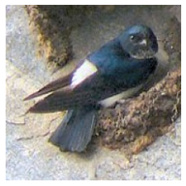

Follow steps below to get started with a jupyter notebook for how to train a Towhee operator.
This example fine-tunes a pretrained ResNet model (eg. resnet-34 pretrained by ImageNet) with a bird dataset.

## 1. Download Operator
Download operator files together with the jupyter notebook.
```bash
$ git clone https://towhee.io/towhee/resnet-image-embedding.git
$ cd resnet-image-embedding/examples
```

## 2. Setup Operator
Create operator and load model by name.
```python
import sys
sys.path.append('..')

from resnet_image_embedding import ResnetImageEmbedding

# Set num_classes=400 for ResNet34 model (400 classes of birds in total)
op = ResnetImageEmbedding('resnet34', num_classes=400)
```

## 3. Configure Trainer:
Modify training configurations on top of default values.

```python
from towhee.trainer.training_config import TrainingConfig

training_config = TrainingConfig()
training_config.batch_size = 32
training_config.epoch_num = 4
training_config.output_dir = 'bird_output'
```

##### 4. Prepare Dataset
Download [BIRDS 400](https://www.kaggle.com/gpiosenka/100-bird-species) from Kaggle Dataset.
And then create the dataset with local path and transform.
```python
import os
from torchvision import transforms
from torchvision.datasets import ImageFolder

bird_400_path = '/path/to/your/dataset/bird_400/'

std = (0.229, 0.224, 0.229)
mean = (0.485, 0.456, 0.406)
transform = transforms.Compose([transforms.ToTensor(),
                                transforms.Normalize(mean=mean, std=std),
                                transforms.RandomHorizontalFlip(p=0.5)
                               ])
train_data = ImageFolder(os.path.join(bird_400_path, 'train'), transform=transform)
eval_data = ImageFolder(os.path.join(bird_400_path, 'valid'), transform=transform)
```

## 5. Start Training

Now start training the operator with Bird-400 dataset.

```python
op.train(training_config, train_dataset=train_data, eval_dataset=eval_data)
```
You will see training results printed out in the progress bar.

    2022-03-04 17:41:49,336 - 139967684245312 - trainer.py-trainer:390 - WARNING: TrainingConfig(output_dir='bird_output', overwrite_output_dir=True, eval_strategy='epoch', eval_steps=None, batch_size=32, val_batch_size=-1, seed=42, epoch_num=4, dataloader_pin_memory=True, dataloader_drop_last=True, dataloader_num_workers=0, lr=5e-05, metric='Accuracy', print_steps=None, load_best_model_at_end=False, early_stopping={'monitor': 'eval_epoch_metric', 'patience': 4, 'mode': 'max'}, model_checkpoint={'every_n_epoch': 1}, tensorboard={'log_dir': None, 'comment': ''}, loss='CrossEntropyLoss', optimizer='Adam', lr_scheduler_type='linear', warmup_ratio=0.0, warmup_steps=0, device_str=None, freeze_bn=False)
    [epoch 1/4] loss=2.244, metric=0.668, eval_loss=2.222, eval_metric=0.935: 100%|███████████████████████████████████████████| 1824/1824 [03:39<00:00,  8.31step/s]
    [epoch 2/4] loss=0.403, metric=0.939, eval_loss=0.426, eval_metric=0.964: 100%|███████████████████████████████████████████| 1824/1824 [03:38<00:00,  8.35step/s]
    [epoch 3/4] loss=0.195, metric=0.972, eval_loss=0.219, eval_metric=0.978: 100%|███████████████████████████████████████████| 1824/1824 [03:39<00:00,  8.31step/s]
    [epoch 4/4] loss=0.115, metric=0.985, eval_loss=0.14, eval_metric=0.979: 100%|████████████████████████████████████████████| 1824/1824 [03:37<00:00,  8.61step/s]

## 6. Predict

With the fine-tuned model, you can then use the operator to classify a bird picture.
```python
import random
import torch
import matplotlib.pyplot as plt

# get random picture and predict it.
img_index = random.randint(0, len(eval_data))
img = eval_data[img_index][0]
img = img.numpy().transpose(1, 2, 0)  # (C, H, W) -> (H, W, C)
pil_img = img * std + mean
plt.axis('off')
plt.imshow(pil_img)
plt.show()
test_img = eval_data[img_index][0].unsqueeze(0).to(op.trainer.configs.device)
logits = op.trainer.predict(test_img)
out = torch.softmax(logits, dim=-1)
probability = torch.max(out).item()
predict_num = torch.argmax(out).item()
print('It is {}.'.format(eval_data.classes[predict_num].lower()))
print('probability = {}'.format(probability))
```

    2022-03-04 17:25:15,019 - 140613268227904 - image.py-image:725 - WARNING: Clipping input data to the valid range for imshow with RGB data ([0..1] for floats or [0..255] for integers).



    It is black baza.
    probability = 0.26655182242393494
