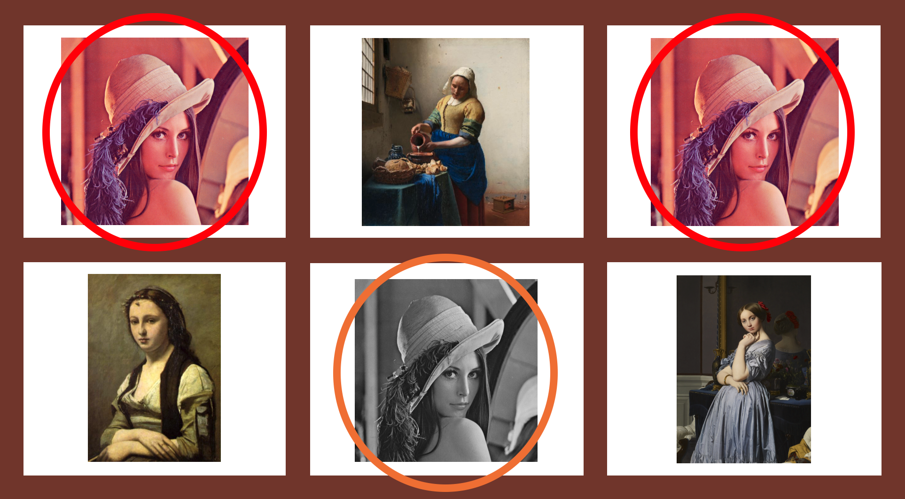

### Overview

Image deduplication is the process of finding exact or near-exact duplicates within a collection of images. For example:



In particular, note that the middle image in the bottom row is not identical to the other two images, despite being a "duplicate". This is where the difficulty here lies - matching pure duplicates is a simple process, but matching images which are similar in the presence of changes in zoom, lighting, and noise is a much more challenging problem.

### Key components

In this section, we go over some key technologies (models, modules, scripts, etc...) used to successfully implement an image deduplication algorithm.

##### Encoder-based embedding model

A generic embedding model turns images into dense vectors; an encoder-based embedding model outputs dense vectors which encode scale-invariant edges and corners within the input image as opposed to pure semantic information. For example, while two images of different dogs may result in two very similar encodings when using traditional object recognition embedding models, the output embeddings would be very different when using encoding-based embedding models. This [blog post](https://towardsdatascience.com/contrastive-loss-explaned-159f2d4a87ec) is a great resource for understanding contrastive loss.

To accomplish this, these encoder models shouldn't be trained on traditional image recognition/localization datasets such as CIFAR or ImageNet; instead, a siamese network trained with contrastive or triplet loss must be used. Towhee provides such a model, pre-built and ready to use in just a single line of code:

```python
>>> from towhee import pipeline
>>> embedding_pipeline = pipeline('image-encoding')  # instantiate the pipeline

>>> img0_embedding = embedding_pipeline('/path/to/img0')  # compute embedding for image 0
>>> img1_embedding = embedding_pipeline('/path/to/img1')  # compute embedding for image 1
```

Unlike the pre-built `image-embedding` pipeline which is trained with categorical cross-entropy on ImageNet labels, the `image-encoding` model is trained to output extremely close embeddings for two "similar" input images, i.e. zero, one, or many of the following transformations:

1. Color conversion, e.g. changes in lighting/contrast
2. Up to 150% zoom plus a random crop
3. Additive salt-and-pepper (Gaussian) noise

These transformations render the model invariant to changes in zoom, lighting, and noise.

##### Similarity metric

The embeddings themselves are useless without a similarity metric. Here, we check if the L2 norm of the difference vector between the query and target images is within a certain threshold. If so, then the images are considered duplicates.

```python
>>> import numpy as np
>>> thresh = 0.01
>>> is_sim = np.linalg.norm(img0_embedding - img1_embedding) < thresh
```

This is an empirically determined threshold based on experiments run on a fully trained model.

### Putting it all together

Putting it all together, we can check if two images are duplicate with the following code snippet:

```python
>>> from towhee import pipeline
>>> import numpy as np

>>> embedding_pipeline = pipeline('image-encoding')
>>> img0_embedding = embedding_pipeline('/path/to/img0')
>>> img1_embedding = embedding_pipeline('/path/to/img1')

>>> is_sim = np.linalg.norm(img0_embedding - img1_embedding) < 0.01
```

And that's it! Have fun and happy embedding :)
