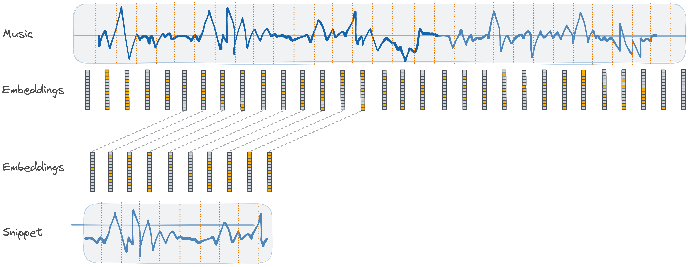
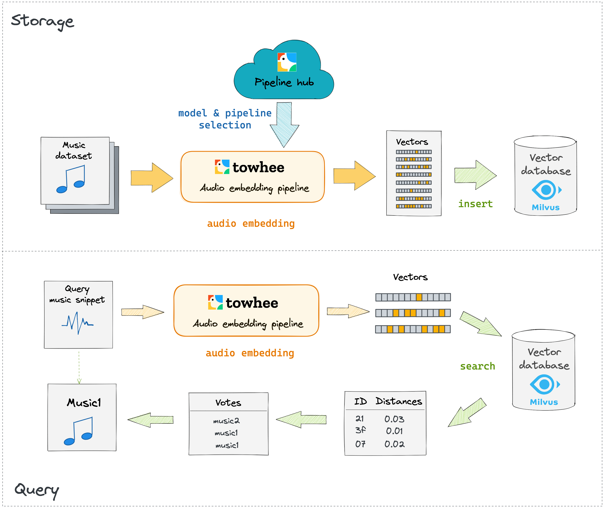

You can download the [music_recognition_tutorial.ipynb](https://github.com/towhee-io/towhee/blob/main/tutorials/music_recognition_tutorial.ipynb) and run it at local with [jupyter notebook](https://jupyter.org/install).

## Scenario Introduction

A **music recognition system** automatically identifies a piece of music by matching a short snippet against a database of known music. Compared to the traditional methods using frequency domain analysis, the use of embedding vectors generated by 1D convolutional neural networks improves recall and can, in some cases, improve query speed.

A music recognition system generally transforms audio data to embeddings and compares similarity based on distances between embeddings. Therefore, an encoder converting audio to embedding and a database for vector storage and retrieval are main components.

## Tutorial Overview

Normally an audio embedding pipeline generates a set of embeddings given an audio path, which composes a unique fingerprint representing the input music. The model selected in the pipeline reads the audio file as a tensor and splits it into shorter tensors of fixed length. These shorter tensors are then taken as an input batch and embeddings are returned for each corresponding input tensor. Each embedding represents features extracted for a snippet of the input audio. By comparing the embeddings of these audio snippets, the system can determine the similarity between separate audio. The image below shows the process of music fingerprinting by audio embeddings.



A block diagram for a basic music recognition system is shown in the images below. The first image illustrates how the system transforms a music dataset into vectors with Towhee and then inserts all vectors into Milvus. The second image shows the querying process of an unknown music snippet. The system begins by using the same pipeline for music dataset fingerprinting to generate a batch of vectors to represent the input music snippet. With this batch, it retrieves the primary key of the closest vector in the database for each vector in the batch. With these results, the audio file that has the most matched keys will be the closest match as the final result.



Building a music recognition system typically involves the following steps:

1. Model and pipeline selection
2. Computing fingerprints for the existing music dataset
3. Insert all generated vectors into a vector database
4. Identify an unknown music snippet by similarity search of vectors

In the upcoming sections, we will first walk you through some of the prep work for this tutorial. After that, we will elaborate on each of the four steps mentioned above.

## Preparation

In this step, we will download the music dataset, install [Towhee](https://towhee.io/), and setup [Milvus](https://milvus.io/), an open source vector database.

### Download dataset

This tutorial uses a subset of [GTZAN](http://marsyas.info/downloads/datasets.html). It contains 10 tracks of music each 30 seconds long and 1 test clip of music 10 seconds long. You can download it via:

- [Google Drive](https://drive.google.com/file/d/1gHF8HDzXxeSy8bhtaTVueRFVPdj6ZEZJ/view?usp=sharing)
- [Dropbox](https://www.dropbox.com/s/hw5vgb385alubb3/music_dataset.zip?dl=0)
- [Aliyundrive](https://www.aliyundrive.com/s/sjb3c48CHc1)

Here we will use `gdown` to download and unzip the data from Google Drive.

```bash
$ pip3 install gdown
$ gdown 'https://drive.google.com/uc?id=1gHF8HDzXxeSy8bhtaTVueRFVPdj6ZEZJ'
$ unzip -q music_dataset.zip
```

The folder `data` downloaded contains two directories - `music_dataset` for the music dataset and `query` for the music snippet to test querying.

### Install Towhee

We'll use `pip` in this tutorial. We also support installing Towhee via `conda` as well as from source; check out [this page](https://docs.towhee.io/get-started/install) for more information.

```bash
$ pip3 install towhee
```

### Setup Milvus

Milvus is an open-source vector database built to power embedding similarity search and AI applications. More info about Milvus is available [here](https://github.com/milvus-io/milvus).

We'll be using `docker-compose` to install Milvus standalone. Before installing Milvus (see the [official Milvus installation guide](https://milvus.io/docs/v2.0.0/install_standalone-docker.md)), make sure you meet all [prerequisites](https://milvus.io/docs/v2.0.0/prerequisite-docker.md).

```bash
# download the latest docker-compose file
$ wget https://github.com/milvus-io/milvus/releases/download/v2.0.0-pre-ga/milvus-standalone-docker-compose.yml -O docker-compose.yml
# start the Milvus service
$ docker-compose up -d
# check the state of the containers
$ docker-compose ps
```

We will also need to install Python SDK for Milvus.

```bash
$ pip3 install pymilvus==2.0.0rc9
```

## Steps in Python

### 1. Model and pipeline selection

The first step in building a music recognition system is selecting an appropriate embedding model and one of its associated pipelines. Within Towhee, all pipelines can be found on the [Towhee hub](https://towhee.io/pipelines). Clicking on any of the categories on the right hand side of the page will filter the results based on the specified task; selecting the `audio-embedding` category will reveal all audio embedding pipelines that Towhee offers. We also provide a summary of popular audio embedding pipelines [here](https://docs.towhee.io/pipelines/audio-embedding).

Resource requirements, accuracy, inference latency are key trade-offs when selecting a proper pipeline. Towhee provides a multitude of pipelines to meet various application demands. For demonstration purposes, we will be using VGGish ([audio-embedding-vggish](https://towhee.io/towhee/audio-embedding-vggish)) in this tutorial.

```python
from towhee import pipeline
embedding_pipeline = pipeline('towhee/audio-embedding-vggish')
```

### 2. Computing fingerprints for the existing music dataset

With an optimal pipeline selected, computing music fingerprints over our music dataset is the next step. All `audio-embedding` Towhee pipelines output a set of vectors (a music fingerprint) given an audio path.

```python
import numpy as np
import os
from pathlib import Path

dataset_path = './music_dataset/dataset'
music_list = [f for f in Path(dataset_path).glob('*')]
vec_sets = []

for audio_path in music_list:
    vecs = embedding_pipeline(str(audio_path))
    norm_vecs = [vec / np.linalg.norm(vec) for vec in vecs[0][0]]
    vec_sets.append(norm_vecs)
```

### 3. Insert all generated embedding vectors into a vector database

While brute-force computation of distances between queries and all audio vectors is perfectly fine for small datasets, scaling to billions of audio dataset items requires a production-grade vector database that utilizes a search index to greatly speed up the query process. Here, we'll insert vectors computed in the previous section into a Milvus collection.

```python
import pymilvus as milvus

# Gather vectors in a list
vectors = []
for i in range(len(vec_sets)):
    for vec in vec_sets[i]:
        vectors.append(vec)

collection_name = 'music_recognition'
vec_dim = len(vectors[0])

# connect to local Milvus service
milvus.connections.connect(host='localhost', port=19530)

# create collection
id_field = milvus.FieldSchema(name="id", dtype=milvus.DataType.INT64, descrition="int64", is_primary=True, auto_id=True)
vec_field = milvus.FieldSchema(name="vec", dtype=milvus.DataType.FLOAT_VECTOR, dim=vec_dim)
schema = milvus.CollectionSchema(fields=[id_field, vec_field])
collection = milvus.Collection(name=collection_name, schema=schema)

# insert data to Milvus
res = collection.insert([vectors])

# maintain mappings between primary keys of music clips and the original music for retrieval
full_music_list = []
music_dict = dict()
for i in range(len(vec_sets)):
    for _ in range(len(vec_sets[i])):
        full_music_list.append(music_list[i])        
for i, pk in enumerate(res.primary_keys):
    music_dict[pk] = full_music_list[i]
```

### 4. Identify an unknown music snippet by similarity search of vectors

We can use the same pipeline to generate a set of vectors for a query audio. Then searching across the collection will find the most closest fingerprint piece for each vector in the set.

```python
query_audio_path = './music_dataset/query/blues_clip.wav'
query_vecs = embedding_pipeline(query_audio_path) # Get vectors of the given audio
norm_query_vecs = [vec / np.linalg.norm(vec) for vec in query_vecs[0][0]] # Normalize vectors

collection.load()
results = collection.search(data=norm_query_vecs, anns_field="vec", param={"metric_type": 'L2'}, limit=1)
```

#### Display result

Vector ids returned by Milvus are then fed into the dictionary, which returns the corresponding paths of the closest-matching audio files in storage. These query results will vote for the final identification of the input audio.

```python
import IPython

votes = [music_dict[x.ids[0]] for x in results]
pred = max(set(votes), key = votes.count)

print(str(pred))
IPython.display.Audio(Path(pred))
```

```python
# Compare with original query snippet
print(str(query_audio_path))
IPython.display.Audio(Path(query_audio_path))
```

## Optimization

This is a simple tutorial of a basic music recognition system. More complex systems are required in production. To make your own solution, we suggest to optimize the system performance with following options:

1. Preprocess data with de-noisy, sliding window method, etc.
2. Switch Towhee pipelines (change model) based on your data
3. Combine with other search strategies
