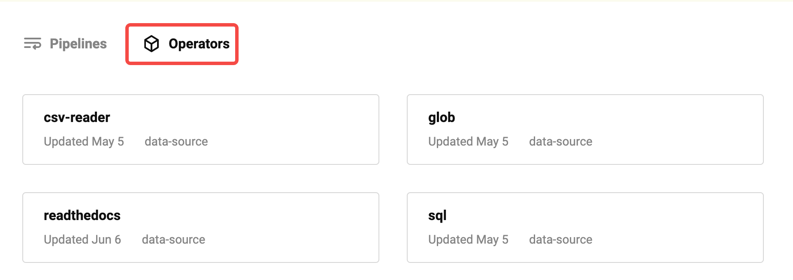

# Usage

Towhee provides a data source module to help users quickly connect to various types of data sources. Supported data sources can be found on[towhee hub](https://towhee.io/data-source).



## How to use

 The data source needs to be used with the DataLoader. DataLoader provides a unified interface to read data from different data sources and perform batching, which is convenient as input for pipeline.
```python
class DataLoader:
    """
    DataLoader

    Args:
        data_source (`Uniton[Iterable, Callable]`)
            Read data from a data_source (can be an iterable or a callable)

        parser (`Callable`)：
            Parse the read data through the parser function to get the input that the pipeline can process.

        batch_size (`int`)
            If batch_size is specified, batch the read data into batches of size batch_size, otherwise yield single data directly

    Examples:
        >>> from towhee import DataLoader, pipe, ops
        >>> p = pipe.input('num').map('num', 'ret', lambda x: x + 1).output('ret')
        >>> for data in DataLoader([{'num': 1}, {'num': 2}, {'num': 3}], parser=lambda x: x['num']):
        >>>     print(p(data).to_list(kv_format=True))
        [{'ret': 2}]
        [{'ret': 3}]
        [{'ret': 4}]
    """
```

Here is an example of using a data source from Towhee Hub. [readthedocs](https://towhee.io/data-source/readthedocs) can obtain a list of documents for a single [readthedocs](https://readthedocs.org/)project and cooperate with the [eqa-insert](https://towhee.io/towhee/eqa-search)pipeline to quickly build a knowledge base based on [Milvus](https://milvus.io/)。

* create milvus collection
```python
from pymilvus import connections, FieldSchema, CollectionSchema, DataType, Collection, utility

collection_name = 'chatbot'
dim = 768

connections.connect(host='127.0.0.1', port='19530')

fields = [
   FieldSchema(name='id', dtype=DataType.INT64, description='ids', is_primary=True, auto_id=True),
   FieldSchema(name='text_id', dtype=DataType.VARCHAR, description='text', max_length=500),
   FieldSchema(name='text', dtype=DataType.VARCHAR, description='text', max_length=1000),
   FieldSchema(name='embedding', dtype=DataType.FLOAT_VECTOR, description='embedding vectors', dim=dim)
]
schema = CollectionSchema(fields=fields, description='enhanced qa')
collection = Collection(name=collection_name, schema=schema)

index_params = {
    'metric_type':"IP",
    'index_type':"IVF_FLAT",
    'params':{"nlist":128}
}
collection.create_index(field_name="embedding", index_params=index_params)
```
* Insert docs
```python
from towhee import AutoPipes, AutoConfig, DataLoader

config = AutoConfig.load_config('eqa-insert')
config.model = 'sentence-t5-large'
config.host = '127.0.0.1'
config.port = '19530'
config.collection_name = collection_name

p = AutoPipes.pipeline('eqa-insert', config=config)

towhee_docs_url = 'https://towhee.readthedocs.io/en/latest/'
loader = DataLoader(ops.data_source.readthedocs(towhee_docs_url,
                                                include='html',
                                                exclude='index.html'))

for data in loader:
    print(data)
    p(data)
```


