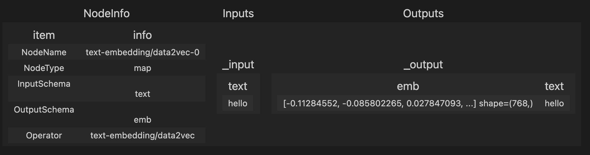
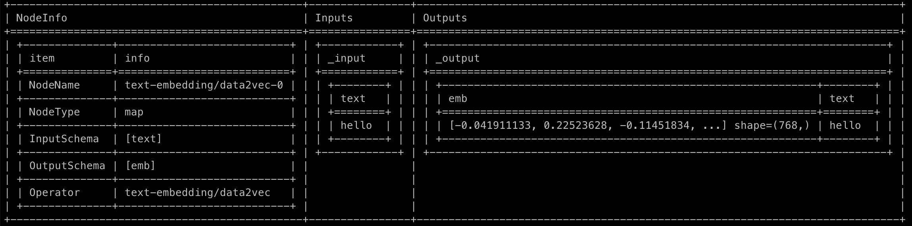
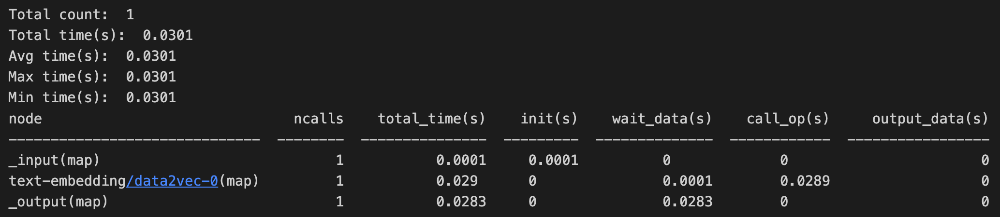
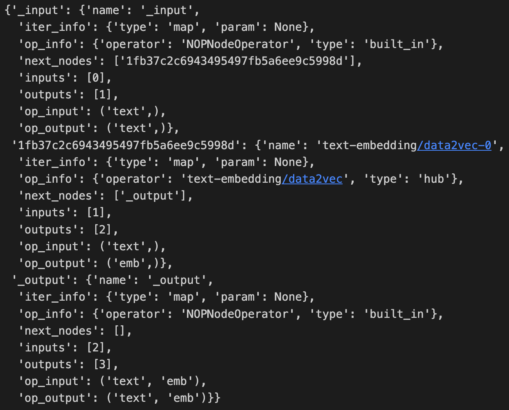

# Debug

Towhee now provides a `debug` api for `pipe` to support profiling and tracing. Users can check the execution efficiency of intermediate nodes as well as their outputs by running a pipeline via `debug`. Also, users are allowed to specify the nodes to trace or not to trace by passing `include` or `exclude` args in debug.

## example pipeline

```python
from towhee import pipe, ops

p = (
    pipe.input('text')
        .map('text', 'emb', ops.text_embedding.data2vec())
        .output('text', 'emb')
)

v = p.debug('hello', batch=False, tracer=True, profiler=True, include=['embedding'])
v.tracer.show()
v.profiler.show()
```

## arguments

**batch**: bool, whether to run in batch mode.

**tracer**: bool, whether to record intermediate nodes info, defaults to False.

**profiler**: bool, whether to record intermediate nodes efficiency, defaults to False.

**include**: str/list, the nodes to trace, defaults to None. If specified, only the specifed nodes will be traced.

**exclude**: str/list, the nodes not to trace, defaults to None.

***Notes***: Users can specify include/exclude nodes by partial names, note that all the nodes that contains the partial name will be regraded include/exclude. For example, we have a pipeline including two embedding nodes, which use text embedding operator and image embedding operator respectively, when we set `include='embedding'`, both the text_embedding and image_embedding nodes will be traced in the pipeline.

## show tracer

The tracer can be showed in two format, depends on the running enviroment:

- When showed in IPython enviroment:


- When showed in command lines:


## show profiler

Profiler records the performance of each node, including the total time, operator initialization time, data waiting time, operator execution time, etc..



## get pipeline info

Also, users can view the pipeline information in the form of a dict by property `v.nodes`:

