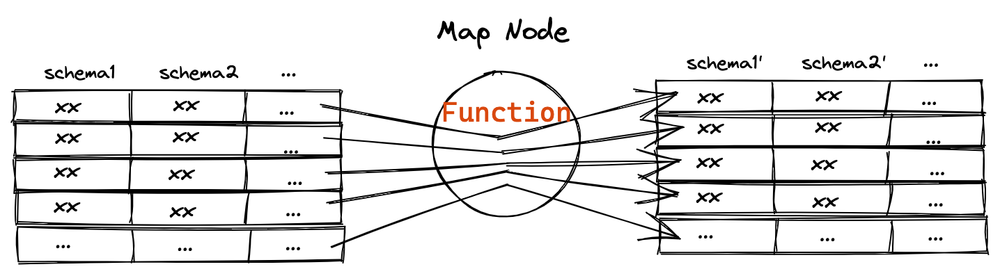
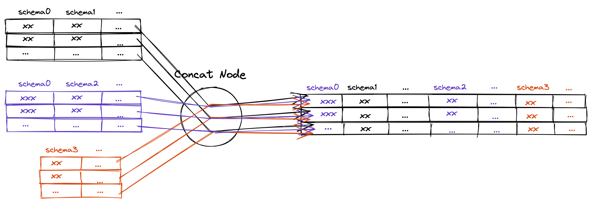

# Towhee in 10 Minutes

This section is a short introduction to `Pipeline`, an unstructured data processing framework provided by `towhee`. More complex examples can be found in the Towhee [GitHub](https://github.com/towhee-io/towhee).


## Preparation

The latest version of `towhee` can be installed with `pip`, or `python -m pip` if `pip` is not presented in your `PATH`:

```shell
$ pip install towhee==1.0.0rc1
```


## Create a Pipeline


This is the simplest example of `Pipeline`, it recieves the input and outputs the data immediately. We start with this Pipeline to illustrate the structure of a Pipeline, a Pieline should at least contain a input and a output node.


```python
from towhee import pipe
p = pipe.input('num').output('num')
res = p(1)
print(res.to_list())
# [[1]]
# print(res.to_list(True))
# [{'num': 1}]
```


## Nodes

### map

Usage:

```python
map(input_schema, output_schema, fn, config=None)
```

Map node get the specified data by input_schema from each element as input, apply it to a function, then specify the schema of output as output_schema.



```python
from towhee import pipe
p = (
	pipe.input('num')
	.map('num', 'num', lambda x: x * 2)
	.output('num')
)

res = p(1)
print(res.to_list())
# [[2]]
```

  
### FlatMap

Usage:

```python
flat_map(input_schema, output_schema, fn, config=None)
```

Flat Map get the specified data by input_schema from each element as input, apply it to a function, then flatten the results, and specify the schema of output as output_schema.


```python
from towhee import pipe
p = (
	pipe.input('num')
		.flat_map('num', 'num', lambda x: [i * 2 for i in x])
		.output('num')
)

res = p([1, 2, 3])
print(res.to_list())
# [[1], [2], [3]]
```

  

### Filter

Usage:

```python
filter(input_schema, output_schema, filter_columns, fn, config=None)
```

Filter only select elements that satisfy the predicate, it will check the function with filter_columns as input. And the input_schema and out_schema are the data before and after the filter node, so their lengths are required to be equal.


```python
from towhee import pipe
p = (
	pipe.input('num')
		.flat_map('num', 'num', lambda x: [i * 2 for i in x])
		.filter('num', 'num', 'num', lambda x: x > 2)
		.output('num')
)

res = p([1, 2, 3])
print(res.to_list())

# [[4], [6]]
```

### Window

Usage:

```python
window(input_schema, output_schema, size, step, fn, config=None)
```

Assign all the elements into windows of finite size, over which to apply computations(fn). The size of each window is configured by the size parameter, the step parameter controls how frequently a window is started.


```python
from towhee import pipe
p = (
	pipe.input('num')
		.flat_map('num', 'num', lambda x: [i * 2 for i in x])
		.window('num', 'nums', 2, 1, lambda x: [i * 2 for i in x])
		.output('num', 'nums')
)

res = p([1, 2, 3, 4])

print(res.to_list())
# [[2, [4, 8]], [4, [8, 12]], [6, [12, 16]], [8, [16]]]
```

### Time Window

Usage:

```python
time_window(input_schema, output_schema, timestamp_col, size, step, fn, config=None)
```

Assign all the elements into time windows of finite size based on the timestamp_col column, over which we can apply computations(fn). The time interval of each time window is configured by the size parameter, and the step parameter controls the time frequency at which a time window starts.


```python
from towhee import pipe
p = (
	pipe.input('num', 'timestamp')
		.flat_map(('num', 'timestamp'), ('num', 'timestamp'), lambda x,y: [(i, j) for i, j in zip(x, y)])
		.time_window('num', 'nums', 'timestamp', 2, 1, lambda x: x)
		.output('nums')
)

res = p([0, 1, 2, 4, 5], [0, 1000, 2000, 4000, 5000])
print(res.to_list())
# [[[0, 1]], [[1, 2]], [[2]], [[4]], [[4, 5]], [[5]]]

# time range
# [0, 2000), [1000, 3000), [2000, 4000), [3000, 5000), [4000, 6000) [5000, 7000)
# result
# [0, 1]     [1, 2]        [2]           [4]           [4, 5]       [5]

```

### Window All

Usage:

```python
window_all(input_schema, output_schema, fn, config=None)
```

Assign all the elements into one window, over which we can apply computations(fn).


```python
from towhee import pipe
p = (
    pipe.input('num')
    .flat_map('num', 'num', lambda x: x)
    .filter('num', 'num', 'num', lambda x: x > 2)
    .window_all('num', 'nums', sum)
    .output('nums')
)

res = p([1, 2, 3, 4])
print(res.to_list())
# [[7]]
```

### Concat

Usage:

```python
concat(*pipeline)
```

Concat one or more pipelines to the existing pipeline and update all data from each pipeline.



```python
from towhee import pipe
pipe0 = (
    pipe.input('nums')
    .flat_map('nums', 'num', lambda x: x)
    )
pipe1 = (
    pipe0.filter('num', 'odd', 'num', lambda x: x % 2 == 1)
    .window_all('odd', 'odd_sum', sum)
    )

pipe2 = (
    pipe0.filter('num', 'even', 'num', lambda x: x % 2 == 0)
    .window_all('even', 'even_sum', sum)
    )

pipe3 = pipe2.concat(pipe1).output('odd_sum', 'even_sum')

res = pipe3([1, 2, 3, 4, 5, 6])
print(res.to_list(True))
#[{'odd_sum': 9, 'even_sum': 12}]
```

## Towhee Operator
Operators are the basic units of computation that can be applied to the elements within a DataCollection. There are many predefined Operators on the [Towhee hub](https://towhee.io/operators?limit=30&page=1), including popular deep learning models ranging from computer vision to natural language processing.

We can load an Operator from the Towhee hub as following:

```python
ops.namespace.operator_name(**kws, *args)
```
example:
```python
from towhee import ops
op = ops.image_decode.cv2("rgb")
img = op('1.jpg')
```

### Custom Operator

It is also easy to define custom operators with standard Python functions with `towhee.register`:
```python
from towhee import register

@register
def add_1(x):
    return x+1

ops.add_1()(2)
```
If the operator needs additional initializations arguments, it can be defined as a class:
```python
@register
class add_x:
    def __init__(self, x):
        self._x = x
    def __call__(self, y):
        return self._x + y

ops.add_x(x=1)(2)
```

### Run Operator with `Pipeline`

When an operator is uploaded to the Towhee hub or registered with @register, we can call the operator directly on a Pipeline:
```python
from towhee import ops, pipe
p = (
	pipe.input('url')
		.map('url', 'image', ops.image_decode.cv2('rgb'))
		.output('url', 'image')
)
DataCollection(p('1.jpg')).show()
```


## Complete Example

Here we show a complete example of towhee `Pipeline` that implements a image embedding task
```python
# image embedding with resnet50
from towhee import ops, pipe
emb_pipe = (
	pipe.input('urls')
		.flat_map('urls', 'urls', lambda x: x)
		.map('urls', 'images', ops.image_decode.cv2('rgb'))
		.map('images', 'embeddings', ops.image_embedding.timm(model_name='resnet50'))
		.output('urls', 'images', 'embeddings')
)

res = emb_pipe(['1.jpg', '2.jpg', '3.jpg'])
DataCollection(res).show()
```