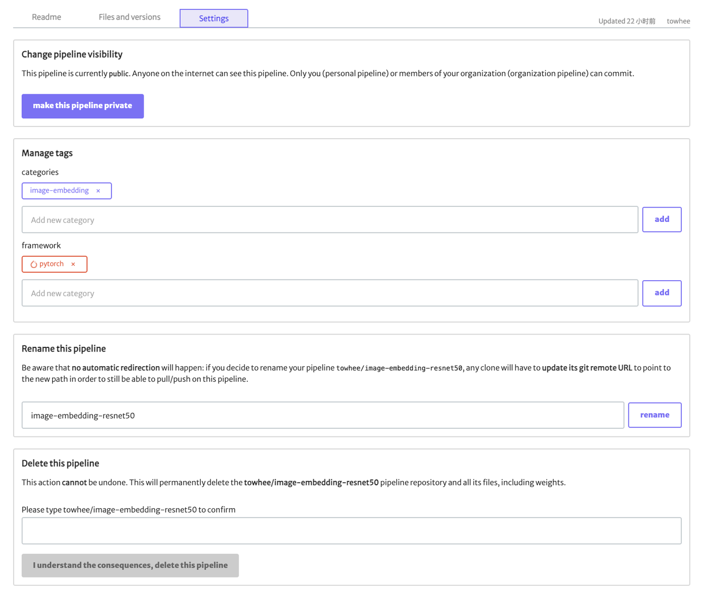

# Towhee hub

## Overview

Towhee hub is a platform to upload and download Towhee-related data files. The data includes [Operators](https://towhee.io/operators) and [Pipelines](https://towhee.io/pipelines) etc. After towhee 0.5.0, everyone can register and contribute to the Towhee hub. You can upload your out-of-the-box pipeline, then use `pipeline(author/pipeline-name)` to download the file and run it easily.

> You may also want to learn about "How to write my first pipeline for Towhee[TBD]" and "[Contribution Guide](https://docs.towhee.io/developer-guides/contributing/contributing-guide)".

There is a `towheehub` tool that can help you easily create, download or initialize a repository. Next, I will introduce the how to use Towhee hub and `towheehub` tool.

## Prerequisites

> If you only want to run the [`download`](#download) or [`generate-yaml`](#generate-yaml) commands, there is no need to install git and git-lfs.

- Create an account for towhee hub: https://towhee.io/user/signup
- Install [git](https://git-scm.com/book/en/v2/Getting-Started-Installing-Git)
- Install [git-lfs](https://git-lfs.github.com)

## Installation and Usage

**(Recommended)** Once you have [installed Towhee](https://docs.towhee.io/get-started/install), you can use `towheehub` with the following command:

```bash
$ pip3 inatsll towhee
$ towheehub <command> -<option> param
```

Of course, you can also run `towhee ` and `towheehub` with source code:

```bash
$ git clone https://github.com/towhee-io/towhee.git
$ python3 setup.py install
$ towheehub <command> -<option> param
```


## Commands

- [`create`](#create--create-operator--create-pipeline)
  - [`create pyoperator`](#create-pyoperator--create-nnoperator--create-pipeline)
  - [`create nnoperator`](#create-pyoperator--create-nnoperator--create-pipeline)
  - [`create pipeline`](#create-pyoperator--create-nnoperator--create-pipeline)
- [`init`](#init-pyoperator--init-nnoperator--init-pipeline)
  - [`init pyoperator`](#init-pyoperator--init-nnoperator--init-pipeline)
  - [`init nnoperator`](#init-pyoperator--init-nnoperator--init-pipeline)
  - [`init pipeline`](#init-pyoperator--init-nnoperator--init-pipeline)
- [`generate-yaml`](#generate-yaml)
- [`download`](#download)
- [`clone`](#clone)

### `create pyoperator` / `create nnoperator` / `create pipeline`

```bash
$ towheehub create --help
usage: towheehub create {pyoperator,nnoperator,pipeline} [-h] -a AUTHOR -r REPO -p [PASSWORD]  [-f FRAMEWORK]

Create Repo on Towhee hub.

positional arguments:
  {pyoperator,nnoperator,pipeline}     Repo type/class.

optional arguments:
  -h, --help                            show this help message and exit
  -a AUTHOR, --author AUTHOR            Author of the Repo.
  -r REPO, --repo REPO                  Repo name.
  -p [PASSWORD], --password [PASSWORD]  Password of the author.
  -f FRAMEWORK, --framework FRAMEWORK   The framework of nnoperator, defaults to 'pytorch'.
```

### `init pyoperator` / `init nnoperator` / `init pipeline`

```bash
$ towheehub init --help
usage: towheehub init {pyoperator,nnoperator,pipeline} [-h] -a AUTHOR -r REPO [-f FRAMEWORK]

Initialize the file structure for your Repo.

positional arguments:
  {pyoperator,nnoperator,pipeline}   Repo type/class.

optional arguments:
  -h, --help                           show this help message and exit
  -a AUTHOR, --author AUTHOR           Author of the Repo.
  -r REPO, --repo REPO                 Repo name.
  -f FRAMEWORK, --framework FRAMEWORK  The framework of nnoperator, defaults to 'pytorch'.
```

### `generate-yaml`

```bash
$ towheehub generate-yaml --help
usage: towheehub generate-yaml [-h] -a AUTHOR -r REPO

Generate yaml file for your Operator Repo.

optional arguments:
  -h, --help                  show this help message and exit
  -a AUTHOR, --author AUTHOR  Author of the Repo.
  -r REPO, --repo REPO        Repo name.
```

### `download`

```bash
$ towheehub download --help
usage: towheehub download [-h] -a AUTHOR -r REPO [-t TAG] [-d DIR]

Download repo file to local(without git).

optional arguments:
  -h, --help                   show this help message and exit
  -a AUTHOR, --author AUTHOR   Author of the Repo.
  -r REPO, --repo REPO         Repo name.
  -t TAG, --tag TAG            Repo tag or branch, defaults to 'main'.
  -d DIR, --dir DIR            Directory to clone the Repo file, defaults to '.'.
```

### `clone`
```bash
$ towheehub download --help
usage: towheehub clone [-h] -a AUTHOR -r REPO [-t TAG] [-d DIR]

Clone repo file to local.

optional arguments:
  -h, --help                   show this help message and exit
  -a AUTHOR, --author AUTHOR   Author of the Repo.
  -r REPO, --repo REPO         Repo name.
  -t TAG, --tag TAG            Repo tag or branch, defaults to 'main'.
  -d DIR, --dir DIR            Directory to clone the Repo file, defaults to '.'.
```

## Examples

### 1. Create your own Repo

You can create your own [Operators](https://towhee.io/operators) and [Pipelines](https://towhee.io/pipelines) in the Towhee hub, and if you enter "y" when asked "Do you want to clone and initialize it with a template?" it will initialize this repo with the template.

- Create PyOperator

  ```bash
  $ towheehub create pyoperator -a <your-account-name> -r <your-operator-name> -p <your-password>
  ```
- Create Pipeline
  ```bash
  $ towheehub create pipeline -a <your-account-name> -r <your-pipeline-name> -p
  
  Password: 
  ```
  
  > The you can enter the password and it will be hidden.

### 2. Initialize the Repo with template

You can also initialize your Repo to the current working directory, which will clone the repo and initialize it according to the template.

- Initialize NNOperator

  ```bash
$ towheehub init nnoperator -a <your-account-name> -r <your-operator-name>
  ```

- Initialize Pipeline

  ```bash
  $ towheehub init pipeline -a <your-account-name> -r <your-pipeline-name>
  ```

### 3. Generate yaml for Operator Repo

The Operator Repo are required a yaml file which contains the basic input and output information of the Operator for other developers to use, and this command will help you generate it automatically.

  ```bash
  $ towheehub generate-yaml -a <your-account-name> -r <your-operator-name>
  ```

### 4. Download the Repo

It will download all files in Repo except **.git** to a specific path (defaults to the current working directory), so it's different with `clone` command.

- Download Repo to  `cwd`

  ```bash
  $ towheehub download -a <your-account-name> -r <your-repo-name>
  ```
- Download Repo to specific directory
  ```bash
  $ towheehub download -a <your-account-name> -r <your-repo-name> -d </your/workspace/path>
  ```

### 5. Clone the Repo

This command is the same as `git clone`, it clones your Repo to a specific path (defaults to the current working directory).

- Clone Repo to  `cwd`

  ```bash
  $ towheehub clone -a <your-account-name> -r <your-repo-name>
  ```
- Download Repo to specific directory
  ```bash
  $ towheehub clone -a <your-account-name> -r <your-repo-name> -d </your/workspace/path>
  ```

## Others

You can also log in to your account at [towheehub](https://hub.towhee.io/user/login), then go to your repo, and you can configure it, such as add categories/framework, rename and delete.


